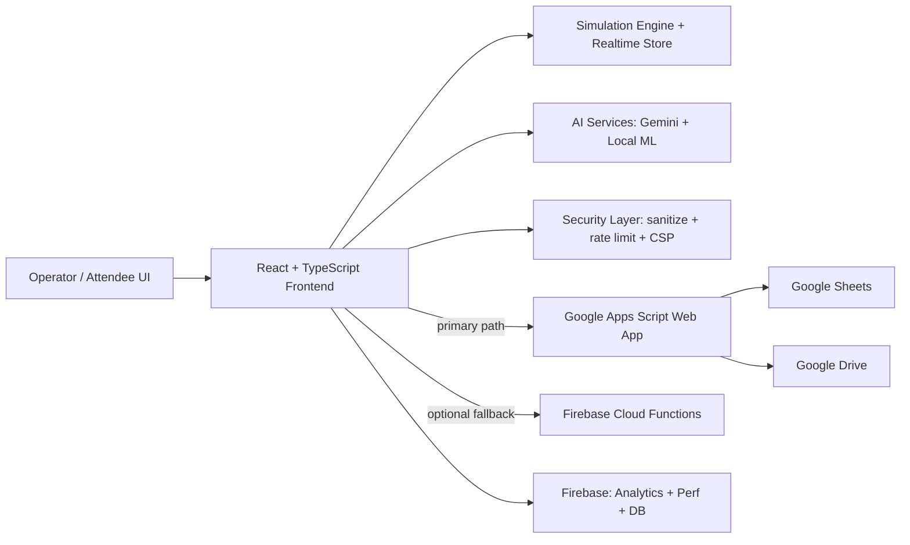

# CrowdPilot AI

CrowdPilot AI is a real-time, AI-assisted crowd operations platform for large venue events.

It helps operations teams predict congestion, optimize routes, manage exits, and export insights to Google services.

## Live Deployment

- App: https://crowdpilot-ai-b5a0d.web.app

## Demo Preview


If you want an animated demo asset, add a GIF at `docs/diagrams/demo.gif` and update this image path.

## Why This Project Matters

- Reduces gate and concourse congestion with proactive recommendations.
- Improves attendee experience via route guidance and wait-time awareness.
- Supports operations staff with explainable AI summaries and tactical suggestions.
- Produces exportable reports for post-match review and planning.

## Core Features

- Live crowd heatmap and zone telemetry simulation.
- AI route optimization (primary + fallback route).
- Match-phase aware operational alerts.
- AI insights panel with:
  - congestion explanation
  - strategy generation
  - staffing recommendations
  - 10-minute demand forecast
- Google integration actions:
  - export report to Sheets
  - log simulation snapshots
  - export wait times
  - save summary artifacts

## Architecture At A Glance



For detailed architecture and module map, see [docs/ARCHITECTURE.md](docs/ARCHITECTURE.md).

## Project Flow

1. Match phase and live metrics update the simulation state.
2. Route, wait time, and alert engines compute operational signals.
3. AI services generate summaries and recommendations.
4. Export actions send data to Google Workspace backend.
5. Status is returned to the UI with source transparency (`workspace`, `functions`, or `local`).

Detailed flow documentation: [docs/FLOW.md](docs/FLOW.md).

## Stack

- Frontend: React 19, TypeScript, Vite
- Data + Telemetry: Firebase Analytics, Performance, Firestore, Realtime Database
- AI: Gemini API + local lightweight ML inference
- Backend Integration:
  - Primary (free-tier friendly): Google Apps Script Web App
  - Optional fallback: Firebase Cloud Functions
- Security: CSP headers, input sanitation, client rate limiting, strict transport headers

Detailed stack notes: [docs/STACK.md](docs/STACK.md).

## Local Development

Install dependencies:

```bash
npm install
```

Run development server:

```bash
npm run dev
```

Build production bundle:

```bash
npm run build
```

Run logic tests:

```bash
npm run test:logic
```

## Environment Setup

Create a local `.env` file and fill your own keys and URLs.

Required categories:

- Firebase web config (`VITE_FIREBASE_*`)
- Gemini key (`VITE_GEMINI_API_KEY`)
- Workspace integration:
  - `VITE_WORKSPACE_API_URL`
  - `VITE_WORKSPACE_API_TOKEN`

Spark-safe recommendation:

- `VITE_ENABLE_CLOUD_FUNCTIONS=false`

Workspace backend template and setup: [workspace-backend/README.md](workspace-backend/README.md).

## Deployment

Deploy Hosting:

```bash
npx firebase-tools deploy --only hosting --project <your_project_id>
```

Current deployed link:

- https://crowdpilot-ai-b5a0d.web.app

## Documentation Index

- [docs/ARCHITECTURE.md](docs/ARCHITECTURE.md)
- [docs/FLOW.md](docs/FLOW.md)
- [docs/STACK.md](docs/STACK.md)
- [docs/FEATURES.md](docs/FEATURES.md)
- [docs/DEPLOYMENT.md](docs/DEPLOYMENT.md)

## Judge-Friendly Evaluation Notes

- Code Quality: modular service architecture, typed contracts, explicit fallback behavior.
- Security: strict hosting headers/CSP, input controls, no secret files tracked.
- Efficiency: workspace-first routing to avoid unnecessary failing backend calls.
- Testing: logic suite and validation scripts included.
- Accessibility: semantic UI sections, readable status messaging, keyboard-friendly controls.
