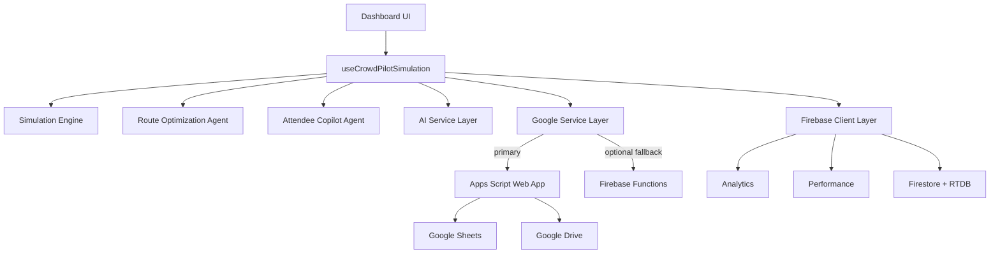

# Architecture

CrowdPilot AI is built as a layered, resilient architecture with clear fallback behavior.

## Layered Design

1. Presentation Layer
- React components and dashboard panels.
- Route planning, alerts, AI controls, and export controls.

2. Simulation + Intelligence Layer
- Crowd simulation engine and scenario transitions.
- Route optimization and congestion analytics.
- AI summary and strategy generation services.

3. Integration Layer
- Primary: Google Apps Script web app for Sheets/Drive operations.
- Optional fallback: Firebase Cloud Functions.
- Final fallback: local heuristic logic for graceful degradation.

4. Data + Telemetry Layer
- Firebase Analytics and Performance metrics.
- Firestore/Realtime persistence hooks for snapshots/history.

## Component Diagram

## Reliability Strategy

- Workspace-first integration to support free-tier constraints.
- Cloud Functions fallback only when explicitly enabled.
- Local fallback to avoid broken UX when backend is unavailable.
- Integration source tagging in UI status for transparency.

## Security Strategy

- Strict CSP and security headers in hosting config.
- Input sanitation and request throttling on client side.
- Workspace token-based request validation in Apps Script.
- Sensitive local artifacts ignored by git.

## Key Source Modules

- `src/hooks/useCrowdPilotSimulation.ts`
- `src/services/googleService.ts`
- `src/services/aiService.ts`
- `src/services/firebaseClient.ts`
- `src/services/security.ts`
- `workspace-backend/Code.gs`
