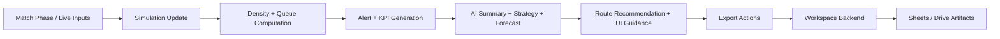
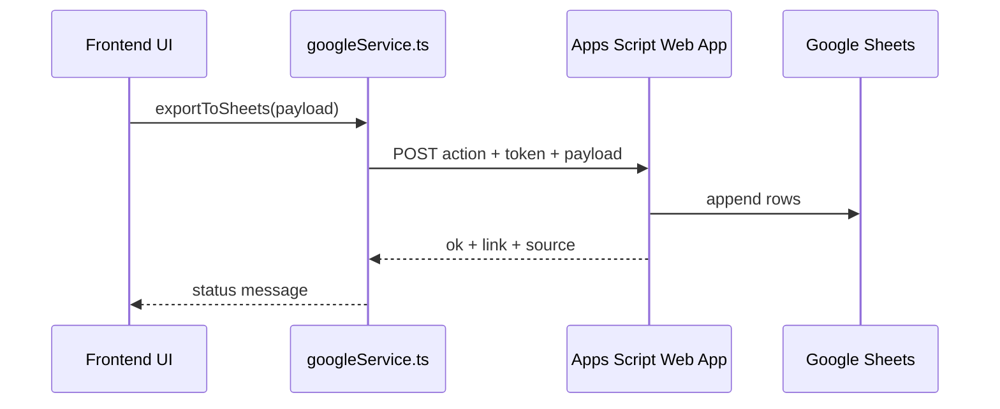

# Product Flow

This document explains how CrowdPilot AI works during live operation.

## Operational Flow

## User Journey

1. Open dashboard and select phase (pre-match, innings break, match end, etc.).
2. Observe live crowd map, KPIs, and alerts.
3. Generate route and inspect journey metrics.
4. Trigger AI actions for congestion explanation and strategy.
5. Export operational reports to Google services.
6. Validate export status in UI and review generated artifacts.

## Export Flow Details

## Fallback Behavior

1. Try Workspace endpoint first.
2. If enabled, try Cloud Functions fallback.
3. Return local heuristic result if no backend path works.
